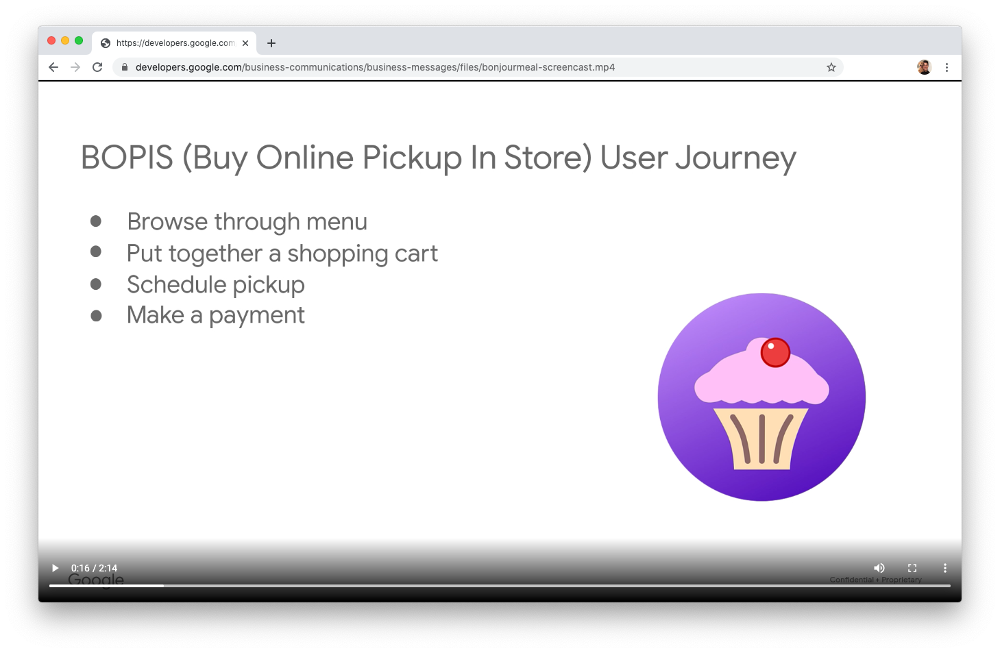

# Bonjour Meal Django Python starter code.

This repository is a [Django](https://www.djangoproject.com/) starter project
for an app on Google's Business Messages. It defines a basic webhook that will
showcase rich features like carousels, rich cards, and suggestion chips, or
will otherwise echo messages back to the user.

This starter code is intended for use with a [Business Messages codelab](http://codelabs.developers.google.com/)
which walks you through the process of starting on Business Messages, to
creating a great social commerce experience that allows you to purchase an item
from the fictitious Bonjour Meal restaurant and schedule a pick up date for your
meal.

The sample can be adapted to your infrastructure, enabling you to launch a
Business Messages experience to engage customers in social commerce with your
company.

# Screencast

View a screencast of this sample in action.

# Codelab tutorial
See our [codelab](https://codelabs.developers.google.com/) tutorial for
detailed instructions on how build this sample and deploy it to Google Cloud App
Engine. Once deployed you can interact with the conversational surface through
Business Messages.

